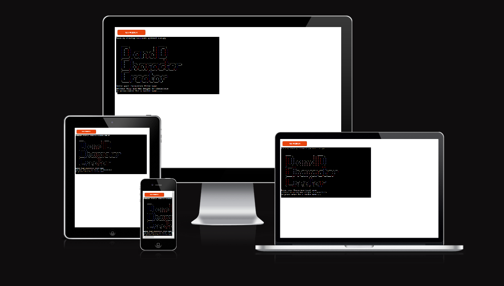
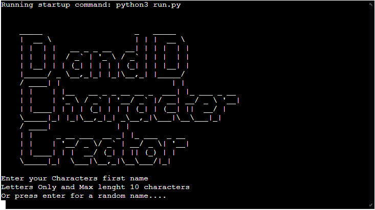
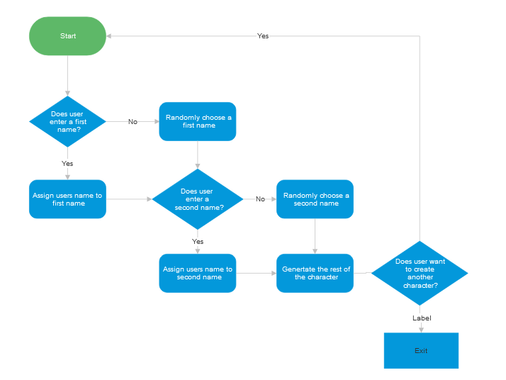
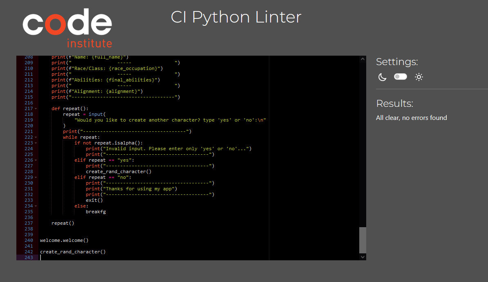

# Welcome to **[D and D Character Creator](https://d-and-d-character-creater-ff16537a5b14.herokuapp.com/)**

## Table of Contents**
- [**Purpose of the game**](#--purpose-of-the-game--)
- [**Why Create This Program**](#why-create-this-program)
- [**Features**](#features)
    - [**Existing Features**](#existing-features)
- [**Future Features**](#future-features)
    - [**Initiative Tracker**](#initiative-tracker)
- [**Flowchart**](#flowchart)
- [**Technology Used**](#technology-used)
    - [**Language**](#language)
    - [**Tools**](#tools)
- [**Testing**](#testing)
    -[**Code Validation on PEP8**](#code-validation-on-pep8)
- [**Bugs**](#bugs)
- [**Deployment**](#deployment)

## **Purpose of the game**

This program was designed to create random characters for a session of Dungeons and Dragons. It will assign a name, class, race, ability scores and alignment for a character.

## **Why Create This Program**

Sometimes you need a little help when creating characters for a Dungeons and Dragons session or as a new player you just want to get stuck in! 

## **Features**
### **Existing Features**

From the start of the program you will see a large title using ASCII to welcome users, followed by the instructions to start

You start by creating the name, either write in the first name followed by the second name, or if you want either name randomly selected for you leave the space blank and hit enter

 

The program will then run and create a character for you

 

After the program will ask you if you would like to continue, or if not, it will exit

### **Future Features**
#### **Initiative Tracker**

In a session of D and D, an Initiative Tracker represents the order in which players act in a combat. In a future update I will add this feature for the created characters as well as a number of enemy characters

## **Flowchart**

## **Technology Used**
### **Language**

This is a command line program built purley in python

### **Tools**
- [Github](https://github.com/) for store and version control of the code
- [Gitpod](https://gitpod.io/workspaces) for editing code
- [Heroku](https://heroku.com/) for deployment
- [Smart Draw](https://smartdraw.com/) for creating flowchart

## **Testing**
### **Code Validation on PEP8**

## **Bugs**

When putting all the code into one function I was getting a NONE at the end of the print ststement. I was printing random_character again at the end of the code, but it wasnt returning anything, also the print statement was already in the function so wasnt needed regardless

When inputting the name I was getting the invalid input error message as i wasnt allowing for the space between the characters. To correct this I vhanged the input from First and LAst name together into seperate inputs

## **Deployment**

Heroku

- Login on the [Heroku](https://id.heroku.com/login) website, [create](https://signup.heroku.com/login) your free account if you don’t have one already.
- On your dashboard, click on the **New** button on the top right corner, and then click on **Create new app**
- Next, type in your project name, it has to be unique, then choose your region and click on **Create App**
- You will come to the next screen, and we will set the **Settings** first and then **Deploy**
- In the **Settings**, set a Config Var, PORT to 8000.
- Then you will scroll down and add two buildpacks in the **Settings**, first **python** and second **nodejs**.
- Go to the **Deploy** tab. In the deployment method, I connected my Github, for this project.
- At the bottom of the page, choose **Manual deploy** and then click on **Deploy Branch** button
- The deployment process will start, and it will take a few minutes
- When the deployment has completed, it will display **Your app was successfully deployed** with a **View** button below the message, that will take you to your deployed site.

